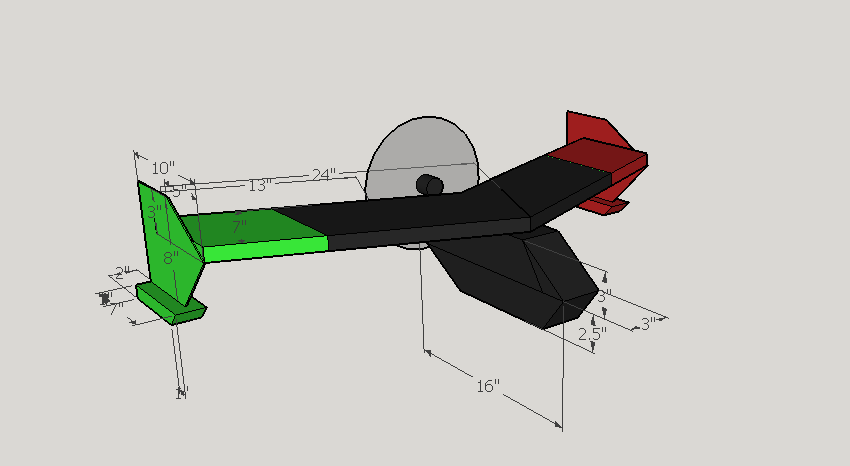
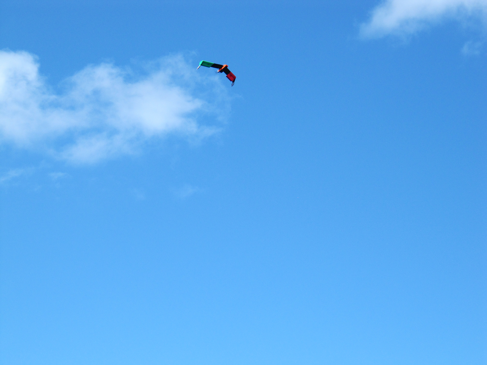
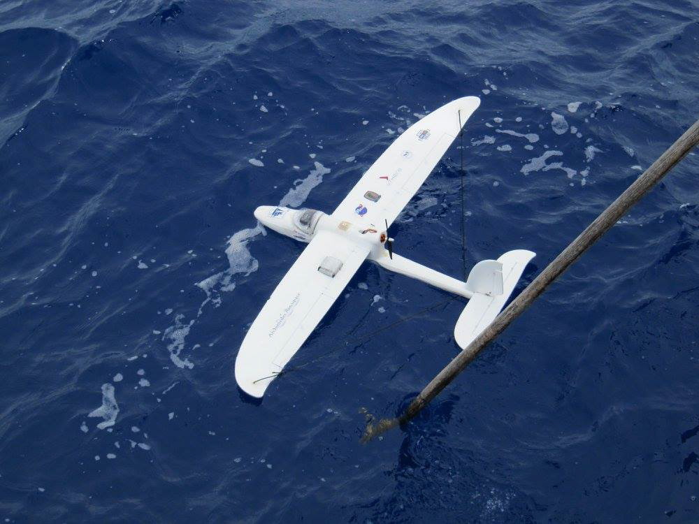

During my time as an intern for Archimedes Aerospace, I worked on a number of projects ranging from sensor design to research presentation. Of these projects, the most significant was the SEA Semester Project. 

SEA Semester, specifically the [SEA Marine Biodiversity and Conservation Program](http://www.sea.edu/voyages/marine_biodiversity_conservation_spring2019), is a research program for college students concerned with the floura and fauna of the North Atlantic sea gyre. Each year, SEA sends out 16-20 students on the SSV Corowith Cramer, a tall ship, to do research at sea while sailing from Puerto Rico to New York. More information on the SEA Marine Biodiversity and Conservation program can be found at its website: [SEA Marine Biodiversity](http://www.sea.edu/voyages/marine_biodiversity_conservation_spring2017)

As an academic partner of SEA, Archimedes is tasked with providing small Unmanned Aerial Systems (sUAS) to the SEA Marine Biodiversity Cruises (MBCs). Archimedes' overarching goal was to correlate small scale, high resolution imagery from our sUAS with large scale, low resolution imagery from satellites. In 2014 the CEO of Archimedes and my boss, John Hanning, gave a great presentation on our mission and methods during the Sargasso Sea Symposium in Woods Hole MA; a video of this presentation can be found here: [John Hanning @ 2014 SEA Symposium](https://www.youtube.com/watch?v=jGhz5RyMTNo&feature=youtu.be&list=PLBD9IjDgLj_KI-K1fyV-SzJ_N14bvHVly). 

This was my project at Archimedes; During the 2014 MBC, I trained with the lead engineer on the project, and during the 2015 and 2016 MBC I took on the position of lead engineer. Each year, the general tasking was the same: design, build and deploy a sUAS to take top down aerial imagery of the ocean.

## **2015**

In 2015, my tasking was to develop a waterproof aircraft capable of taking top down imagery, and to explore a design capable of taking off and landing from the water. This was a daunting task to begin with, but to complicate things further, our project wasn't funded until 3 weeks before the ship was to set sail. With 3 weeks of time and my design constraints, I put together this aircraft, the SEA Shark I. It's a flying wing design with a drop down fuselage and wingtip pontoons. The aircraft performed wonderfully for it's first and only flight off of the boat; after landing, a capacitor was blown on a faulty motor controller. [Blog Post from 2015](http://www.sea.edu/sea_currents/single/ramblings_of_an_intern)

 

## **2016**

My tasking for 2016 was once again to develop a waterproof craft capable of taking top down imagery, but this time with autonomous capabilities. Due to the complexities added by the autopilot, I chose to use a standard hobby grade airframe, the Hobbyking Bixler. This year, I integrated a uThere Ruby autopilot, provided by Archimedes. After weeks of design, construction and testing, the SEA Shark II was born. This year in particular we had resounding success; we were able to complete 4 full length flights, each time attempting a different search pattern, and use flight data directly from the autopilot to coordinate positioning with an overhead imagery satellite. 

[Blog Post from 2016](http://www.sea.edu/sea_currents/corwith_cramer/welcome_to_bermuda)

